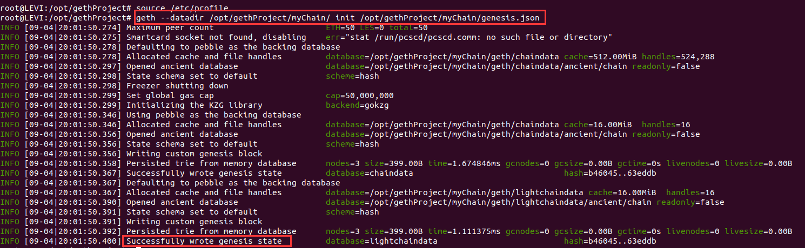
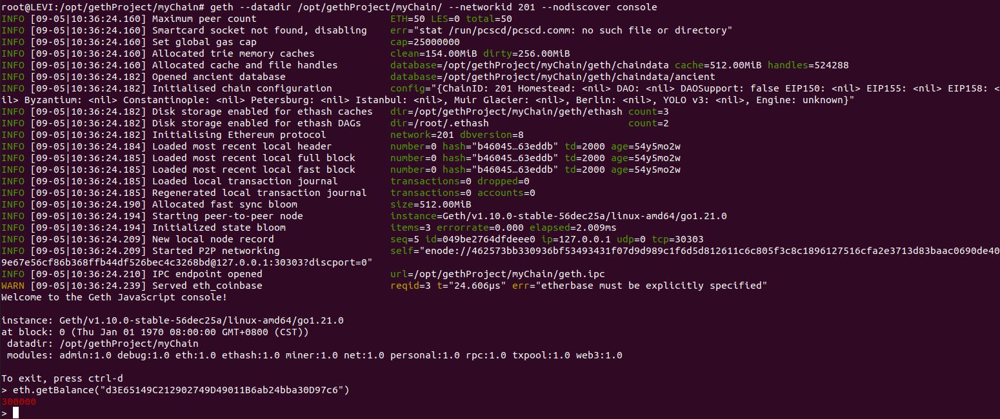

# 搭建私链

1.创建网络的"创世"状态，写在一个json文件里：`/opt/gethProject/myChain/genesis.json`

```json
{
"config": {
    "chainId": 201,
    "homesteadBlock": 0,
    "eip150Block": 0,
    "eip155Block": 0,
    "eip158Block": 0,
    "byzantiumBlock": 0,
    "constantinopleBlock": 0,
    "petersburgBlock": 0,
    "istanbulBlock": 0
},
"alloc": {
        "d3E65149C212902749D49011B6ab24bba30D97c6": { "balance": "300000"},
        "f41c74c9ae680c1aa78f42e5647a62f35367bdde": { "balance": "400000"}
   },
"coinbase": "0x0000000000000000000000000000000000000000",
"difficulty": "0x2000",
"extraData": "",
"gasLimit": "0x2fefd8",
"nonce": "0x0000000000000042",
"mixhash": "0x0000000000000000000000000000000000000000000000000000000000000000",
"parentHash": "0x0000000000000000000000000000000000000000000000000000000000000000",
"timestamp": "0x00"
}
```

2.初始化私链：

```
geth --datadir /opt/gethProject/myChain/ init /opt/gethProject/myChain/genesis.json
```



> 此时在myChain下多了一个geth文件夹
>
> ├── genesis.json
> ├── geth
> │   ├── chaindata
> │   ├── lightchaindata（所有初始状态信息都写在这里）
> │   ├── LOCK
> │   └── nodekey（内容是一个ID，节点的唯一编号，用于节点交互识别）
> └── keystore（用来存储密钥）

3.在当前目录下运行geth，就会启动这条私链，注意要将networkId 设置为与创世块配置里的chainld一致。

```
geth --datadir /opt/gethProject/myChain/ --networkid 201 --nodiscover console
```

4.正常启动




