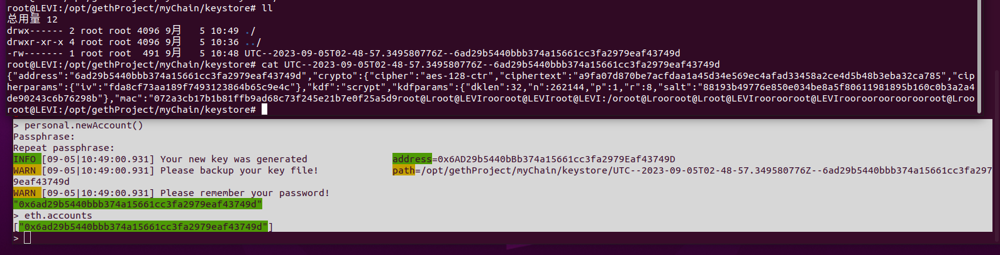
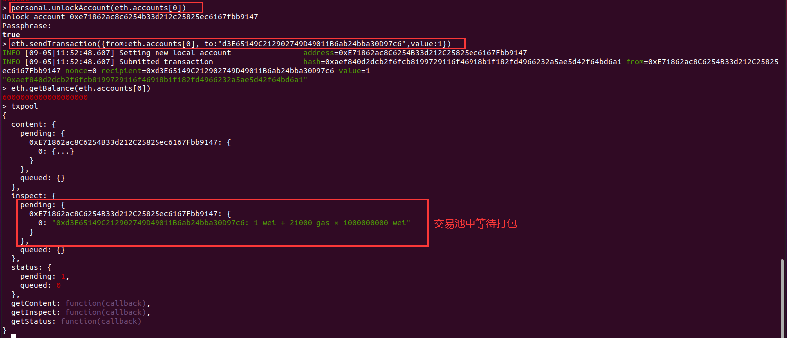
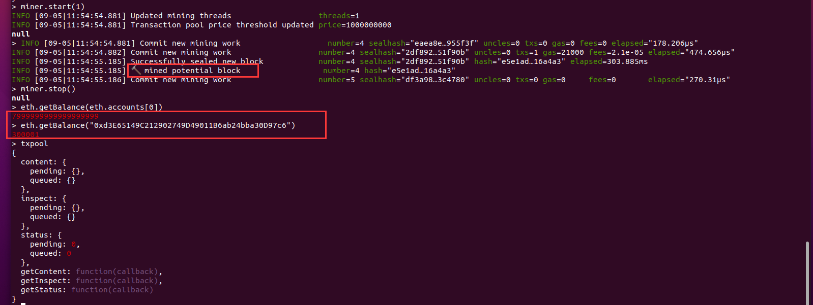
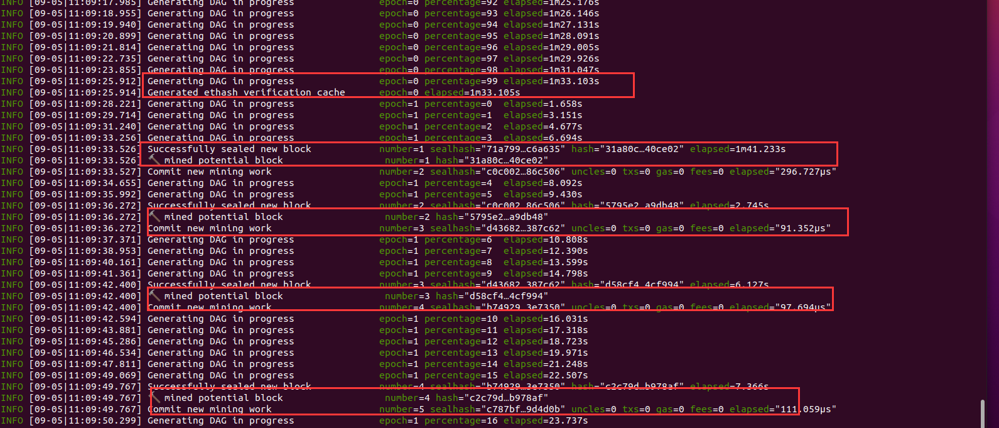
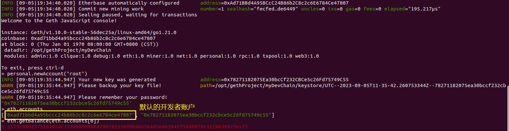

# 控制台操作

## 组件

查看web3对象：主要就分为这些可以用的属性和方法（省略了大量的内容）

```json
{
  admin: {},
  db: {},
  debug: {},
  eth: {}, // 非常重要
  ethash: {},
  miner: {}, // 矿工，用于出块
  net: {},
  personal:{}, // 用于控制账户
  providers: {},
  rpc: {},
  settings: {},
  shh: {},
  txpool: {}, // 交易池：pending等待上链的交易
  version: {},
  [通用方法]
}
```

admin

```json
{
  datadir: "/opt/gethProject/myChain",
  nodeInfo: { // 我们启动的节点的完整信息
    ....
      listener: 30303 // 监听地址
    },
   ....
  },
  peers: [], // 此时只有我一个节点，周围没有其他节点
  [通用方法]
}
```

eth

```json
{
  accounts: [],
  blockNumber: 0,
  .....
  gasPrice: 1000000000, // 默认
 .....
}
```

personal

```json
{
    ......
  newAccount: function(), // 重要
  openWallet: function(),
  sendTransaction: function(),
  sign: function(),
  signTransaction: function(),
      ....
}
```

txpool

```json
{
  [一开始全是空的]
}
```

miner

```json
{
	[挖矿相关]
}
```

等等

## 指令

- 启动私链：`geth --datadir /opt/gethProject/myChain/ --networkid 201 --nodiscover --rpc --rpcaddr "0.0.0.0" console 2>output.log`。
  - `--datadir /opt/gethProject/myChain/`：指定数据存储的路径，指定哪里，就从哪里取数据来启动
  - `--networkid 201`：指定哪个链启动，我这里是指定本地私链
  - `--nodiscover`：不然会一直显示Looking for peers
  - `--rpc`：RPC支持，默认是本地8545端口。
  - `--rpcaddr "0.0.0.0"`：虚拟机测试使用，不加这个则物理机metamask无法访问虚拟机中的geth
  - `console`：交互
  - `2>output.log`：将提示信息重定向，不然看的很乱，另一个控制台输入`tail -f output.log`实时监控。

- `--syncmodefast`：是geth启动的参数，表示我们会议快速模式同步区块，我们只会下载每个区块头和区块体，但不会执行验证所有的交易，直到所有区块同步完毕再去获取一个系统当前的状态。这样就节省了很多交易验证的时间。默认情况下是full模式，同步主网。
- 查看账户：`eth.accounts`。genesis.json中分配给的账户的钱不存在这里，这个指令只会显示存在于keystore中的账户，也就是存储newAccount创建的账户
- 查看余额：`eth.getBalance("xxxxxxxxx")`
- 单位转换[wei转ether]：`web3.fromWei(eth.getBalance("f41c74c9ae680c1aa78f42e5647a62f35367bdde"),"ether")`
- 查看区块高度：`eth.blockNumber`
- 创建账户：`personal.newAccount()`，文件+密码就可以解出私钥。geth存私钥的方式是用keystore



- 快速得到账户：`eth.accounts[n]`。JS语法，得到accounts数组中的账户
- 转账：`eth.sendTransaction({from:eth.accounts[0], to:"d3E65149C212902749D49011B6ab24bba30D97c6",value:1})`。
  - from需要是钱包中的：eth.accounts
  - 如果出现这个报错`Error: invalid sender`：genesis配置文件问题，建议使用本仓库的
  - 下面的例子中，coinbase是eth.accounts[0]，因此发送成功1wei之后，获得了区块奖励





- 解锁钱包里面的账户：`personal.unlockAccount(eth.accounts[0])`。相当于你输入密码到metamask解锁
- 用私钥导入账户：`personal.inportRawKey()`
- 开始挖矿：`miner.start(1)`。参数1指进程数。一开始会生成 DAG，这是以太坊工作证明算法使用的数据集。生成需要一些时间，但每 30000 个区块才更新一次。



- 停止挖矿：`miner.stop()`
- 用交易hash查看详细信息：`eth.getTransaction("0x694ff9dbe78567b93fa34d90710fac91ceeadef0e20ce15e4d05550c5ecf8301")`

```json
{
  blockHash: "0x673c27944ebc0e669fd82b3c3efd994b8a4ac35940fd5b69ca1eaf28094f218b",
  blockNumber: 1,
  from: "0xad71bbd4a95bccc24b86b2c8c2c6e6784ce47807",
  gas: 21000,
  gasPrice: 1,
  hash: "0x694ff9dbe78567b93fa34d90710fac91ceeadef0e20ce15e4d05550c5ecf8301",
  input: "0x",
  nonce: 0,
  r: "0x8d3511b75f0c479b3d6e4e38ba6fdaf4995a949f17127b41b8586918707572d8",
  s: "0x1e12dcea1b31e98fcf9a1dba345a178cf61ff50ab2a94d8756800f72920df31e",
  to: "0x78271182075ea30bccf232cbce5c26fd75749c55",
  transactionIndex: 0,
  type: "0x0",
  v: "0xa96",
  value: 1
}
```

- 查看区块信息：`eth.getBlock("n")`

```json
{
  difficulty: 1,
  extraData: "0x0000000000000000000000000000000000000000000000000000000000000000ad71bbd4a95bccc24b86b2c8c2c6e6784ce478070000000000000000000000000000000000000000000000000000000000000000000000000000000000000000000000000000000000000000000000000000000000",
  gasLimit: 11500000,
  gasUsed: 0,
  hash: "0x9220c664df57c6aa0a7071b543bf92f481955e3576649716a2be2786c1606dcc",
  logsBloom: "0x00000000000000000000000000000000000000000000000000000000000000000000000000000000000000000000000000000000000000000000000000000000000000000000000000000000000000000000000000000000000000000000000000000000000000000000000000000000000000000000000000000000000000000000000000000000000000000000000000000000000000000000000000000000000000000000000000000000000000000000000000000000000000000000000000000000000000000000000000000000000000000000000000000000000000000000000000000000000000000000000000000000000000000000000000000000",
  miner: "0x0000000000000000000000000000000000000000",
  mixHash: "0x0000000000000000000000000000000000000000000000000000000000000000",
  nonce: "0x0000000000000000",
  number: 0,
  parentHash: "0x0000000000000000000000000000000000000000000000000000000000000000",
  receiptsRoot: "0x56e81f171bcc55a6ff8345e692c0f86e5b48e01b996cadc001622fb5e363b421",
  sha3Uncles: "0x1dcc4de8dec75d7aab85b567b6ccd41ad312451b948a7413f0a142fd40d49347",
  size: 622,
  stateRoot: "0xd2fc01380ba77721141454ffa39bd627cdf20b5f9763ff8c75db0372f27a09c4",
  timestamp: 0,
  totalDifficulty: 1,
  transactions: [],
  transactionsRoot: "0x56e81f171bcc55a6ff8345e692c0f86e5b48e01b996cadc001622fb5e363b421",
  uncles: []
}
```

- gas估计：`eth.estimateGas({from:eth.accounts[0], to:eth.accounts[0], value:1, data:"0x01"})`

## RPC

- 查看geth版本信息

```shell
root@LEVI:/home/levi/桌面# curl -X POST -H "Content-Type: application/json" --data '{"jsonrpc": 2.0,"method": "web3_clientVersion","params":[],"id":1}' http://localhost:8545
{"jsonrpc":"2.0","id":1,"result":"Geth/v1.10.0-stable-56dec25a/linux-amd64/go1.21.0"}
```

- 查看区块号

```shell
root@LEVI:/home/levi/桌面# curl -X POST -H "Content-Type: application/json" --data '{"jsonrpc": 2.0,"method": "eth_blockNumber","params":[],"id":1}' http://localhost:8545
{"jsonrpc":"2.0","id":1,"result":"0xa"}
```

## 开发者模式

直接输入：`geth --datadir /opt/gethProject/myDevChain --dev console`

- 这里面自动挖矿，因此我们不需要使用`miner.start()`
- 已经自动解锁




